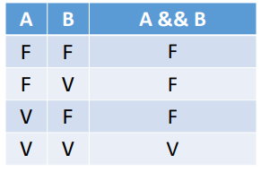
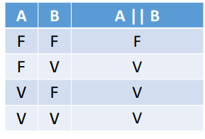
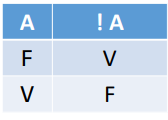

# Estrutura Condicional

---

## Expressões comparativas
-  maior >
-  menor <
-  maior ou igual >=
-  menor ou igual <=
-  igual == 
-  diferente !=
---
## Expressões lógicas

### && (e)

### || (ou)

### ! (não)

---

## Estrutura condicional
### if (se)
### else if (ou se)
### else (se não)